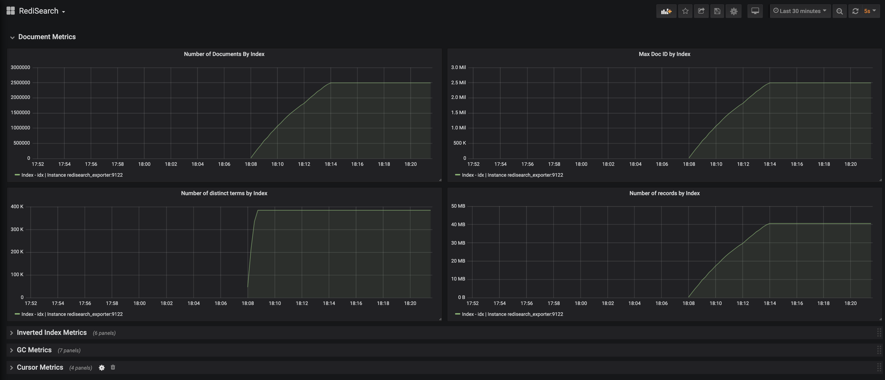
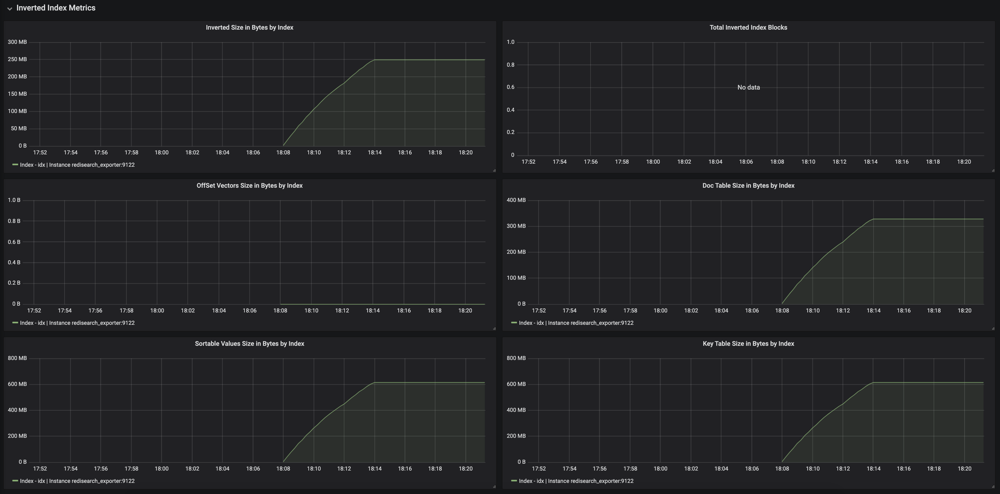
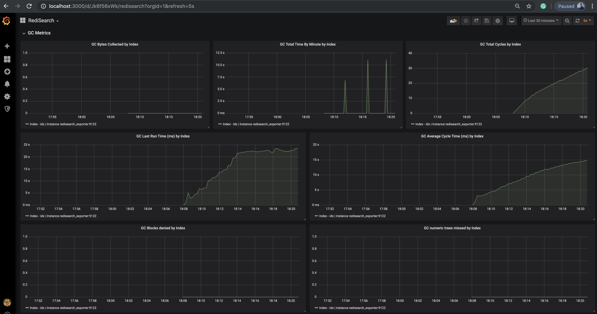
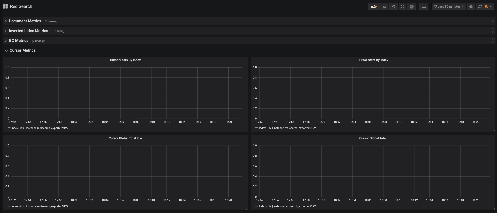

# RediSearch Metrics Exporter

Prometheus exporter for RediSearch metrics.\
Supports RediSearch v1.4, v1.6, >=v2.0

This code is based on a fork of work initially made public by oliver006 at https://github.com/filipecosta90/redisearch_prometheus_exporter.


## Build and run locally

```sh
    $ go get github.com/filipecosta90/redisearch_prometheus_exporter
    $ cd $GOPATH/src/github.com/filipecosta90/redisearch_prometheus_exporter
    $ make
    $ ./redisearch_prometheus_exporter <flags>
```

## Configuring

### Basic Prometheus Configuration

Add a block to the `scrape_configs` of your prometheus.yml config file:

```yaml
scrape_configs:
  - job_name: redisearch_prometheus_exporter
    static_configs:
    - targets: ['<<REDIS-EXPORTER-HOSTNAME>>:9122']
```

and adjust the host name accordingly.

### Prometheus Configuration to Scrape Multiple Redis Hosts

Run the exporter with the command line flag `--redis.addr=` so it won't try to access 
the local instance every time the `/metrics` endpoint is scraped.

```yaml

scrape_configs:
  ## config for the multiple Redis targets that the exporter will scrape
  - job_name: 'redis_exporter_targets'
    static_configs:
      - targets:
        - redis://first-redis-host:6379
        - redis://second-redis-host:6379
        - redis://second-redis-host:6380
        - redis://second-redis-host:6381
    metrics_path: /scrape
    relabel_configs:
      - source_labels: [__address__]
        target_label: __param_target
      - source_labels: [__param_target]
        target_label: instance
      - target_label: __address__
        replacement: <<REDIS-EXPORTER-HOSTNAME>>:9122
  
  ## config for scraping the exporter itself
  - job_name: 'redisearch_exporter'
    static_configs:
      - targets:
        - <<REDIS-EXPORTER-HOSTNAME>>:9122
```

The Redis instances are listed under `targets`, the Redis exporter hostname is configured via the last relabel_config rule.\
If authentication is needed for the Redis instances then you can set the password via the `--redis.password` command line option of
the exporter (this means you can currently only use one password across the instances you try to scrape this way. Use several 
exporters if this is a problem). \
You can also use a json file to supply multiple targets by using `file_sd_configs` like so:

```yaml

scrape_configs:
  - job_name: 'redisearch_prometheus_exporter_targets'
    file_sd_configs:
      - files:
        - targets-redisearch-instances.json
    metrics_path: /scrape
    relabel_configs:
      - source_labels: [__address__]
        target_label: __param_target
      - source_labels: [__param_target]
        target_label: instance
      - target_label: __address__
        replacement: <<REDIS-EXPORTER-HOSTNAME>>:9122

  ## config for scraping the exporter itself
  - job_name: 'redisearch_prometheus_exporter'
    static_configs:
      - targets:
        - <<REDIS-EXPORTER-HOSTNAME>>:9122
```

The `targets-redisearch-instances.json` should look something like this:

```json
[
  {
    "targets": [ "redis://redis-host-01:6379", "redis://redis-host-02:6379"],
    "labels": { }
  }
]
```

Prometheus uses file watches and all changes to the json file are applied immediately.

## Running

### Flags

## What's exported?

Most items from the FT.INFO command are exported,
see https://oss.redislabs.com/redisearch/Commands.html#ftinfo for details.





